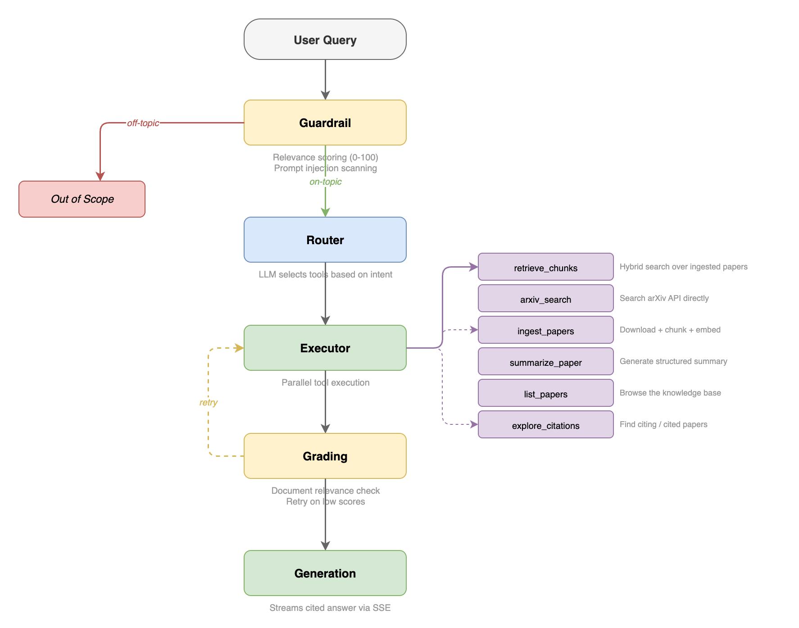
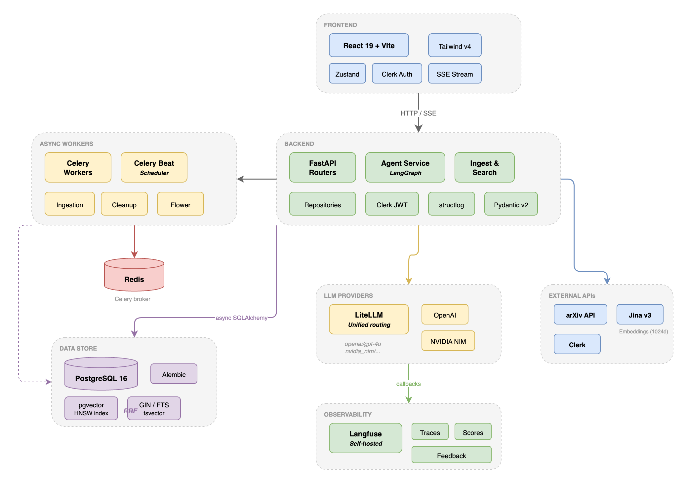

<div align="center">


**An agentic RAG system for academic research.**

Search, ingest, summarize, and explore citations across arXiv papers through a conversational AI agent backed by a LangGraph workflow, hybrid retrieval, and a shared knowledge base.

[](https://github.com/spencerjireh/arxivian/actions/workflows/ci.yml)


</div>

---

## How It Works

You chat with an AI agent that has access to six specialized tools. The agent decides which tools to call, executes them (potentially in parallel), grades the retrieved context for relevance, and streams a cited answer back to you in real time.

<div align="center">

</div>

## Architecture

<div align="center">

</div>

## Tech Stack

| Layer | Technologies |
|-------|-------------|
| **Frontend** | React 19, TypeScript, Vite, Tailwind CSS v4, Zustand, Framer Motion, GSAP |
| **Backend** | FastAPI, Python 3.11, async SQLAlchemy 2.0, Pydantic v2 |
| **Agent** | LangGraph (graph-based workflow), LiteLLM (multi-provider routing) |
| **Retrieval** | pgvector HNSW (vector), PostgreSQL GIN/tsvector (full-text), Reciprocal Rank Fusion |
| **Embeddings** | Jina Embeddings v3 (1024d) |
| **Auth** | Clerk (JWT + Google OAuth), tiered rate limiting |
| **Async** | Celery 5 + Redis (broker), Celery Beat (scheduler), Flower (monitoring) |
| **Observability** | Langfuse (self-hosted), structlog with request ID correlation |
| **Infra** | Docker Compose (dev/test/prod/eval profiles), Alembic migrations |
| **CI** | GitHub Actions -- ruff, ty, pytest, eslint, tsc, vitest |

## Quick Start

**Prerequisites:** Docker, Docker Compose, [just](https://github.com/casey/just)

```bash
git clone https://github.com/spencerjireh/arxivian.git
cd arxivian

just setup              # Create .env files from examples
# Edit backend/.env and frontend/.env with your API keys (see below)
just dev                # Build and start everything with hot reload
```

| Service | URL |
|---------|-----|
| Frontend | http://localhost:5173 |
| API docs | http://localhost:8000/docs |
| Langfuse | http://localhost:3001 |
| Flower | http://localhost:5555 |

### Required API Keys

| Key | File | Purpose |
|-----|------|---------|
| `OPENAI_API_KEY` | `backend/.env` | LLM calls via LiteLLM |
| `JINA_API_KEY` | `backend/.env` | Document embeddings (Jina v3) |
| `CLERK_SECRET_KEY` | `backend/.env` | JWT verification |
| `VITE_CLERK_PUBLISHABLE_KEY` | `frontend/.env` | Clerk auth UI |

## Development

```bash
just dev                # Start all services with hot reload
just down               # Stop services
just logs               # Tail all logs
just test               # Run full test suite (~466 tests)
just test -k "pattern"  # Run tests matching pattern
just lint               # Ruff linter
just check              # Lint + typecheck (backend)
just fix                # Auto-fix lint + format
just lint-frontend      # ESLint
just test-frontend      # Vitest
just eval               # Run LLM-backed evals (requires API keys)
just migrate            # Run Alembic migrations
just db-shell           # PostgreSQL shell
just shell-backend      # Shell into backend container
just clean              # Stop, remove volumes + images
just --list             # See all 30+ commands
```

## Key Design Decisions

**Hybrid retrieval with RRF.** Vector search alone misses keyword-specific queries; full-text search alone misses semantic similarity. Combining pgvector HNSW with PostgreSQL GIN/tsvector via Reciprocal Rank Fusion gives the best of both, without adding an external search engine.

**LangGraph over chains.** The agent workflow has conditional branching (guardrail gating, retry loops on poor document grades, parallel tool execution). LangGraph's explicit graph structure makes these control flows testable and observable, rather than burying them in chain callbacks.

**LiteLLM for model routing.** A single client handles OpenAI, NVIDIA NIM, and any future providers via prefix routing (`openai/gpt-4o-mini`). Switching models is a config change, not a code change.

**Communal knowledge base.** Papers are shared across all users. When one user ingests a paper, everyone benefits. This avoids redundant storage and embeddings while building a richer corpus over time.

**Langfuse over LangSmith.** Self-hosted, open-source, with native LiteLLM integration via global callbacks. Traces, scores, and user feedback all link through trace IDs returned in SSE metadata.

## Testing

The test suite is organized by scope:

| Suite | Count | What it covers |
|-------|-------|---------------|
| Unit | ~258 | Services, repositories, agent nodes, tools, edges |
| API | ~141 | Router endpoints with mocked dependencies |
| Eval | Variable | LLM-backed evaluation of agent responses (requires API keys) |

```bash
just test                          # All unit + API tests
just test tests/unit/              # Unit only
just test tests/api/               # API only
just eval                          # LLM evals
```

Coverage threshold is 80%, enforced in CI.

## License

[AGPL-3.0](LICENSE)
