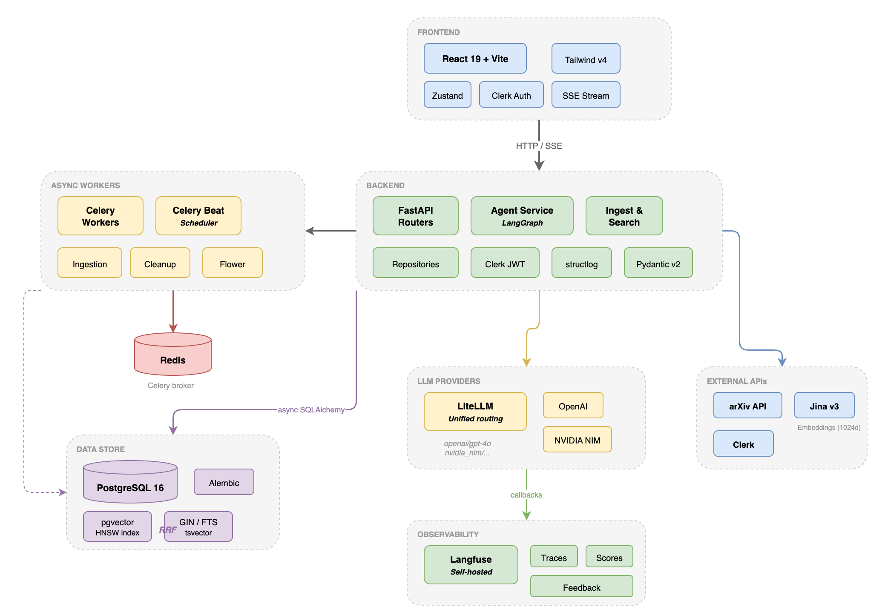

<div align="center">


**A weekly feed of arXiv papers you could actually implement.**

Arxivian scores new ML papers on method clarity, resource feasibility, data availability and demand, ranks them for your compute budget and interests, and lets you chat with each paper's full text.

[](https://github.com/spencerjireh/arxivian/actions/workflows/ci.yml)


</div>

---

## How It Works

1. **Triage (weekly, cheap).** New papers in your categories are fetched from arXiv and filtered by a small LLM pass.
2. **Score (per paper).** The full text is ingested and judged by TypeSafe Jev on four dimensions: method clarity, resource feasibility (compute tier), data availability (a PASS/FAIL gate) and demand (Semantic Scholar citations). Every judgment carries quoted evidence and a calibrated confidence.
3. **Digest (weekly).** Scores are snapshotted into a ranked digest per category set.
4. **Feed (read time).** Cards show a composite score, a one-line verdict, signal chips (pseudocode, public datasets, single GPU, code released) and a fit marker for your compute profile. Save, dismiss or mark papers as implementing; open one for the per-dimension breakdown and a chat scoped to that paper.

`docs/product/feed-prd.md` is the product-of-record; `docs/design/scoring-pipeline.md` and `docs/design/scoring-rubric.md` describe the pipeline and the rubric; `CLAUDE.md` maps the code.

## Architecture

<div align="center">

</div>

## Tech Stack

| Layer | Technologies |
|-------|-------------|
| **Frontend** | React 19, TypeScript, Vite, Tailwind CSS v4, TanStack Query, Zustand |
| **Backend** | FastAPI, Python 3.11, async SQLAlchemy 2.0, Pydantic v2 |
| **Scoring** | TypeSafe Jev (typed judgments with calibrated probabilities), LangGraph fan-out DAG |
| **Chat** | LangGraph agent scoped to one paper, LiteLLM, SSE streaming |
| **Retrieval** | pgvector HNSW (vector), PostgreSQL GIN/tsvector (full-text), Reciprocal Rank Fusion |
| **Embeddings** | Jina Embeddings v3 (1024d) |
| **Auth** | Clerk (JWT + Google OAuth), tiered rate limiting |
| **Async** | Celery 5 + Redis (broker), RedBeat (scheduler), Flower (monitoring) |
| **Observability** | Langfuse (self-hosted), structlog with request ID correlation |
| **Infra** | Docker Compose (dev/test/prod/eval profiles), Alembic migrations, Coolify |
| **CI** | GitHub Actions -- ruff, ty, pytest, eslint, tsc, vitest |

## Quick Start

**Prerequisites:** Docker, Docker Compose, [just](https://github.com/casey/just)

```bash
git clone https://github.com/spencerjireh/arxivian.git
cd arxivian

just setup              # Create .env files from examples
# Edit backend/.env and frontend/.env with your API keys (see below)
just dev                # Build and start everything with hot reload
```

| Service | URL |
|---------|-----|
| Frontend | http://localhost:5173 |
| API docs | http://localhost:8000/docs |
| Langfuse | http://localhost:3001 |
| Flower | http://localhost:5555 |

### Required API Keys

| Key | File | Purpose |
|-----|------|---------|
| `OPENAI_API_KEY` | `backend/.env` | Triage and chat LLM calls via LiteLLM |
| `TYPESAFE_API_KEY` | `backend/.env` | Stage 2 scoring (Jev) |
| `JINA_API_KEY` | `backend/.env` | Document embeddings (Jina v3) |
| `CLERK_SECRET_KEY` | `backend/.env` | JWT verification |
| `VITE_CLERK_PUBLISHABLE_KEY` | `frontend/.env` | Clerk auth UI |

Semantic Scholar runs keyless (requests are paced through Redis).

## Development

```bash
just dev                # Start all services with hot reload
just down               # Stop services
just test               # Backend test suite (unit, api, integration)
just test -k "pattern"  # Tests matching a pattern
just check              # Lint + typecheck (backend)
just fix                # Auto-fix lint + format
just lint-frontend      # ESLint
just test-frontend      # Vitest
just eval               # LLM-backed evals (requires API keys)
just inteval -k scoring # Golden-set scoring eval against the real judge
just migrate            # Run Alembic migrations
just --list             # All recipes
```

## Key Design Decisions

**Typed judgments instead of free-text grading.** Scoring asks a judge model closed questions (yes/no, a choice, a level) and stores the full probability distribution plus the quoted evidence. The stored integers are denormalizations; the composite is recomputed at read time so weights can change without re-scoring.

**Read-time ranking.** The digest caches membership and a provisional order; personalization (compute-profile fit, keyword tie-breaks, NULL-safe weight renormalization) is computed per request from the live rows.

**Hybrid retrieval with RRF.** pgvector HNSW plus PostgreSQL GIN/tsvector fused by Reciprocal Rank Fusion, with no external search engine. Paper-scoped chat retrieves inside one paper only.

**Communal knowledge base.** Ingested papers are shared across users; scoring a paper once serves everyone.

**Langfuse over LangSmith.** Self-hosted, open-source, native LiteLLM integration; traces link through the trace id returned in SSE metadata.

## Testing

| Suite | Marker | What it covers |
|-------|--------|---------------|
| Unit | `unit` | Schemas, services, nodes, tasks, clients (mocked I/O) |
| API | `api` | Routers with mocked dependencies |
| Integration | `integration` | Repositories and migrations against a real pgvector database |
| Eval | `eval`, `inteval` | Golden-set agreement for triage and scoring (real API keys) |

```bash
just test                          # unit + api + integration
just test tests/unit               # one suite
just eval                          # LLM evals
```

## License

[AGPL-3.0](LICENSE)
